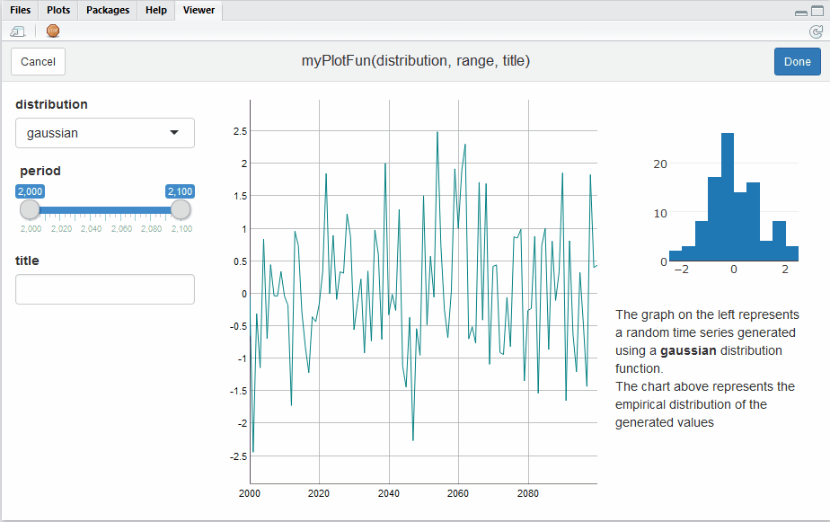

Add more interactivity to interactive charts
================

This R package is largely inspired by the `manipulate` package from Rstudio. It can be used to easily create graphical interface that lets the user modify the data or the parameters of an interactive chart. It also provides the `combineWidgets` function to easily combine multiple interactive charts in a single view. Of course both functions can be used together.

Here is an example:



Installation
------------

The package can be installed from Github with package `devtools`:

``` r
devtools::install_github("rte-antares-rpackage/manipulateWidget")
```

To install the latest development version:

``` r
devtools::install_github("rte-antares-rpackage/manipulateWidget", ref="develop")
```
