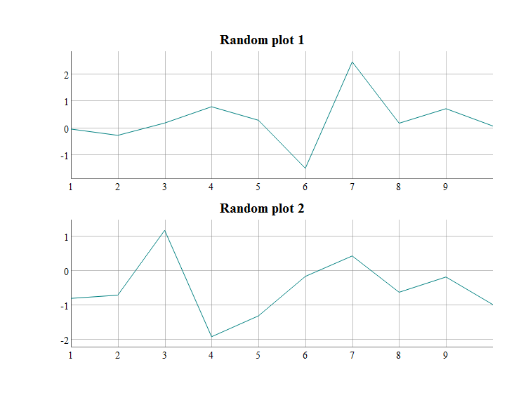
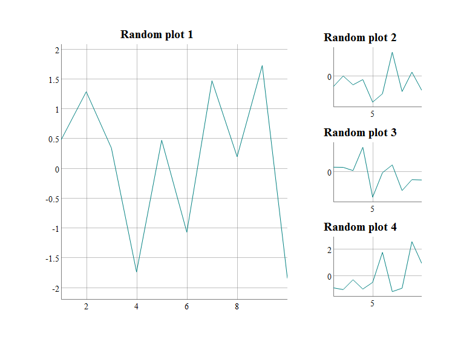
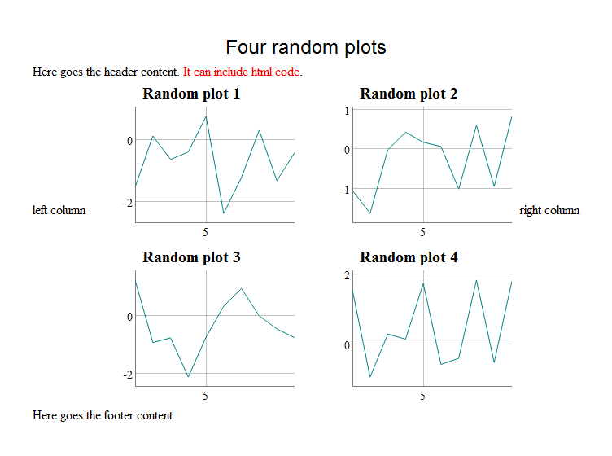

Add more interactivity to interactive charts
================

[](http://cran.r-project.org/package=manipulateWidget)

This R package is largely inspired by the `manipulate` package from Rstudio. It provides the function \``manipulateWidget` that can be used to create in a very easy way a graphical interface that let the user modify the data or the parameters of an interactive chart. Technically, the function generates a Shiny gadget, but the user does not even have to know what is Shiny.

The package also provides the `combineWidgets` function to easily combine multiple interactive charts in a single view. Of course both functions can be used together.

Here is an example that uses packages `dygraphs` and `plot_ly`.


Installation
------------

The package can be installed from CRAN:

``` r
install.packages("manipulateWidget")
```

You can also install the latest development version from github:

``` r
devtools::install_github("rte-antares-rpackage/manipulateWidget", ref="develop")
```

Getting started
---------------

The main function of the package is `manipulateWidget`. It accepts an expression that generates an interactive chart (and more precisely an htmlwidget object. See <http://www.htmlwidgets.org/> if you have never heard about it) and a set of controls created with functions mwSlider, mwCheckbox... which are used to dynamically change values within the expression. Each time the user modifies the value of a control, the expression is evaluated again and the chart is updated. Consider the following code:

``` r
manipulateWidget(
  myPlotFun(country), 
  country = mwSelect(c("BE", "DE", "ES", "FR"))
)
```

It generates a graphical interface with a select input on its left with options "BE", "DE", "ES", "FR". The value of this input is mapped to the variable `country` in the expression. By default, at the beginning the value of `country` will be equal to the first choice of the input. So the function will first execute `myPlotFun("BE")` and the result will be displayed in the main panel of the interface. If the user changes the value to "FR", then the expression `myPlotFun("FR")` is evaluated and the new result is displayed.

The interface also contains a button "Done". When the user clicks on it, the last chart is returned. It can be stored in a variable, be modified by the user, saved as a html file with saveWidget from package htmlwidgets or converted to a static image file with package `webshot`.

Of course, you can create as many controls as you want. The interface of the animated example in the introduction was generated with the following code:

``` r
manipulateWidget(
  myPlotFun(distribution, range, title),
  distribution = mwSelect(choices = c("gaussian", "uniform")),
  range = mwSlider(2000, 2100, value = c(2000, 2100), label = "period"),
  title = mwText()
)
```

To see all available controls that can be added to the UI, take a look at the list of the functions of the package:

``` r
help(package = "manipulateWidget")
```

Combining widgets
-----------------

The `combineWidgets` function gives an easy way to combine interactive charts (like `par(mfrow = c(...))` or `layout` for static plots). To do it, one has simply to pass to the function the widgets to combine. In the next example, we visualize two random time series with dygraphs and combine them.

``` r
library(dygraphs)

plotRandomTS <- function(id) {
  dygraph(data.frame(x = 1:10, y = rnorm(10)), main = paste("Random plot", id))
}

combineWidgets(plotRandomTS(1), plotRandomTS(2))
```



The functions tries to find the best number of columns and rows. But one can control them with parameters `nrow`and `ncol`. It is also possible to control their relative size with parameters `rowsize` and `colsize`. To achieve complex layouts, it is possible to use nested combined widgets. Here is an example of a complex layout. (Note that this is only a screenshot of the result. In reality, these charts are interactive).

``` r
combineWidgets(
  ncol = 2, colsize = c(2, 1),
  plotRandomTS(1),
  combineWidgets(
    ncol = 1,
    plotRandomTS(2),
    plotRandomTS(3),
    plotRandomTS(4)
  )
)
```



Even if the main use of `combineWidgets` is to combine `htmlwidgets`, it can also display text or html tags. It can be useful to include comments in a chart. Moreover it has arguments to add a title and to add some html content in the sides of the chart.

``` r
combineWidgets(
  plotRandomTS(1),
  plotRandomTS(2),
  plotRandomTS(3),
  plotRandomTS(4),
  title = "Four random plots",
  header = "Here goes the header content. <span style='color:red'>It can include html code</span>.",
  footer = "Here goes the footer content.",
  leftCol = "<div style='margin-top:150px;'>left column</div>",
  rightCol = "<div style='margin-top:150px;'>right column</div>"
)
```



Advanced usage
--------------

### Grouping controls

If you have a large number of inputs, you can easily group them. To do so, simply pass to the function `manipulateWidget` a list of inputs instead of passing directly the inputs. Here is a toy example. Groups are by default collapsed and user can click on their title to display/collapse then.

``` r
mydata <- data.frame(x = 1:100, y = rnorm(100))
manipulateWidget(
  dygraph(mydata[range[1]:range[2], ],
          main = title, xlab = xlab, ylab = ylab),
  range = mwSlider(1, 100, c(1, 100)),
  "Graphical parameters" = list(
    title = mwText("Fictive time series"),
    xlab = mwText("X axis label"),
    ylab = mwText("Y axis label")
  )
)
```


### Conditional inputs

Sometimes some inputs are relevant only if other inputs have some value. `manipulateWidget`provides a way to show/hide inputs conditionally to the value of the other inputs thanks to parameter `.display`. This parameter expects a named list of expressions. The names are the ones of the inputs to show/hide and the expressions can include any input and have to evaluate to `TRUE/FALSE`. Here is a toy example, using package `plot_ly`. User can choose points or lines to represent some data. If he chooses lines, then an input appears to let him choose the width of the lines.

``` r
mydata <- data.frame(x = 1:100, y = rnorm(100))

myPlot <- function(type, lwd) {
  if (type == "points") {
    plot_ly(mydata, x= ~x, y = ~y, type = "scatter", mode = "markers")
  } else {
    plot_ly(mydata, x= ~x, y = ~y, type = "scatter", mode = "lines", 
            line = list(width = lwd))
  }
}

manipulateWidget(
  myPlot(type, lwd),
  type = mwSelect(c("points", "lines"), "points"),
  lwd = mwSlider(1, 10, 1),
  .display = list(lwd = type == "lines")
)
```


### Updating a widget

The "normal" use of `manipulateWidget` is to provide an expression that always return an `htmlwidget`. In such case, every time the user changes the value of an input, the current widget is destroyed and a new one is created and rendered. This behavior is not optimal and sometimes it can be painful for the user: consider for instance an interactive map. Each time user changes an input, the map is destroyed and created again, then zoom and location on the map are lost every time.

Some packages provide functions to update a widget that has already been rendered. This is the case for instance for package `leaflet` with the function `leafletProxy`. To use such functions, `manipulateWidget` evaluates the parameter `.expr` with two extra variables:

-   `.initial`: `TRUE` if the expression is evaluated for the first time and then the widget has not been rendered yet, `FALSE` if the widget has already been rendered.

-   `.session`: A shiny session object.

Moreover the ID of the rendered widget is always "output". Then it is quite easy to write an expression that initializes a widget when it is evaluated the first time and then that updates this widget. Here is an example using package `leaflet`.

``` r
lon <- rnorm(10, sd = 20)
lat <- rnorm(10, sd = 20)

myMapFun <- function(radius, color, initial, session) {
  if (initial) {
    # Widget has not been rendered
    map <- leaflet() %>% addTiles()
  } else {
    # widget has already been rendered
    map <- leafletProxy("output", session) %>% clearMarkers()
  }

  map %>% addCircleMarkers(lon, lat, radius = radius, color = color)
}

manipulateWidget(myMapFun(radius, color, .initial, .session),
                 radius = mwSlider(5, 30, 10),
                 color = mwSelect(c("red", "blue", "green")))
```


By the way
----------

Here is the complete code to generate the animated example in the introduction:

``` r
library(dygraphs)
library(plotly)
library(manipulateWidget)

myPlotFun <- function(distribution, range, title) {
  randomFun <- switch(distribution, gaussian = rnorm, uniform = runif)
  myData <- data.frame(
    year = seq(range[1], range[2]),
    value = randomFun(n = diff(range) + 1)
  )
  combineWidgets(
    ncol = 2, colsize = c(2, 1),
    dygraph(myData, main = title),
    combineWidgets(
      plot_ly(x = myData$value, type = "histogram"),
      paste(
        "The graph on the left represents a random time series generated using a <b>",
        distribution, "</b>distribution function.<br/>",
        "The chart above represents the empirical distribution of the generated values."
      )
    )
  )
  
}

manipulateWidget(
  myPlotFun(distribution, range, title),
  distribution = mwSelect(choices = c("gaussian", "uniform")),
  range = mwSlider(2000, 2100, value = c(2000, 2100), label = "period"),
  title = mwText()
)
```
