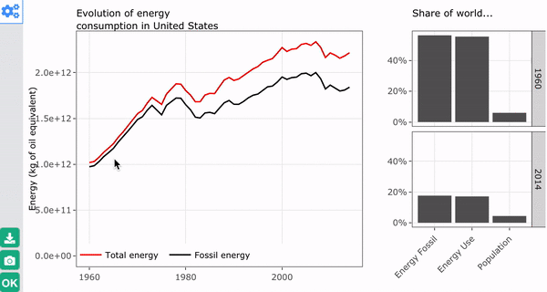

Add more interactivity to interactive charts
================

[](http://cran.r-project.org/package=manipulateWidget) [](http://cran.r-project.org/package=manipulateWidget)

This R package is largely inspired by the `manipulate` package from Rstudio. It provides the function `manipulateWidget` that can be used to create in a very easy way a graphical interface that let the user modify the data or the parameters of an interactive chart. Technically, the function generates a Shiny gadget, but the user does not even have to know what is Shiny.

Why should you use it?
----------------------

All functionalities of this package can be replicated with other packages like [shiny](https://shiny.rstudio.com/), [flexdashboard](http://rmarkdown.rstudio.com/flexdashboard/), [crosstalk](http://rstudio.github.io/crosstalk/) and others. So why another package?

`manipulateWidget` has three advantages:

-   It is easy and fast to use. Only a few lines of `R` are necessary to create a user interface.
-   Code can be included in any R script. No need to create a dedicated .R or .Rmd file.
-   It works with all htmlwidgets. In contrast, `crosstalk` only supports a few of them.

`manipulateWidget` can be especially powerful for users who are exploring some data set and want to quickly build a graphical tool to see what is in their data. `manipulateWidget` has also some advanced features that can be used with almost no additional code and that could seduce some package developers: grouping inputs, conditional inputs and comparison mode.

Installation
------------

The package can be installed from CRAN:

``` r
install.packages("manipulateWidget")
```

You can also install the latest development version from github:

``` r
devtools::install_github("rte-antares-rpackage/manipulateWidget", ref="develop")
```

Getting started
---------------

The hard part for the user is to write a code that generates an interactive chart. Once this is done, he only has to describe what parameter of the code should be modified by what input control. For instance, consider the following code that identifies clusters in the iris data set and uses package `plotly` to generate an interactive scatter plot.

``` r
library(plotly)
data(iris)

plotClusters <- function(xvar, yvar, nclusters) {
  clusters <- kmeans(iris[, 1:4], centers = nclusters)
  clusters <- paste("Cluster", clusters$cluster)
  
  plot_ly(x = ~iris[[xvar]], y = ~iris[[yvar]], color = ~clusters,
          type = "scatter", mode = "markers") %>% 
    layout(xaxis = list(title=xvar), yaxis = list(title=yvar))
}

plotClusters("Sepal.Width", "Sepal.Length", 3)
```

<!--html_preserve-->

<script type="application/json" data-for="htmlwidget-1319ed577a97678b0f29">{"x":{"layout":{"margin":{"b":40,"l":60,"t":25,"r":10},"xaxis":{"domain":[0,1],"title":"Sepal.Width"},"yaxis":{"domain":[0,1],"title":"Sepal.Length"},"hovermode":"closest"},"source":"A","config":{"modeBarButtonsToAdd":[{"name":"Collaborate","icon":{"width":1000,"ascent":500,"descent":-50,"path":"M487 375c7-10 9-23 5-36l-79-259c-3-12-11-23-22-31-11-8-22-12-35-12l-263 0c-15 0-29 5-43 15-13 10-23 23-28 37-5 13-5 25-1 37 0 0 0 3 1 7 1 5 1 8 1 11 0 2 0 4-1 6 0 3-1 5-1 6 1 2 2 4 3 6 1 2 2 4 4 6 2 3 4 5 5 7 5 7 9 16 13 26 4 10 7 19 9 26 0 2 0 5 0 9-1 4-1 6 0 8 0 2 2 5 4 8 3 3 5 5 5 7 4 6 8 15 12 26 4 11 7 19 7 26 1 1 0 4 0 9-1 4-1 7 0 8 1 2 3 5 6 8 4 4 6 6 6 7 4 5 8 13 13 24 4 11 7 20 7 28 1 1 0 4 0 7-1 3-1 6-1 7 0 2 1 4 3 6 1 1 3 4 5 6 2 3 3 5 5 6 1 2 3 5 4 9 2 3 3 7 5 10 1 3 2 6 4 10 2 4 4 7 6 9 2 3 4 5 7 7 3 2 7 3 11 3 3 0 8 0 13-1l0-1c7 2 12 2 14 2l218 0c14 0 25-5 32-16 8-10 10-23 6-37l-79-259c-7-22-13-37-20-43-7-7-19-10-37-10l-248 0c-5 0-9-2-11-5-2-3-2-7 0-12 4-13 18-20 41-20l264 0c5 0 10 2 16 5 5 3 8 6 10 11l85 282c2 5 2 10 2 17 7-3 13-7 17-13z m-304 0c-1-3-1-5 0-7 1-1 3-2 6-2l174 0c2 0 4 1 7 2 2 2 4 4 5 7l6 18c0 3 0 5-1 7-1 1-3 2-6 2l-173 0c-3 0-5-1-8-2-2-2-4-4-4-7z m-24-73c-1-3-1-5 0-7 2-2 3-2 6-2l174 0c2 0 5 0 7 2 3 2 4 4 5 7l6 18c1 2 0 5-1 6-1 2-3 3-5 3l-174 0c-3 0-5-1-7-3-3-1-4-4-5-6z"},"click":"function(gd) { \n        // is this being viewed in RStudio?\n        if (location.search == '?viewer_pane=1') {\n          alert('To learn about plotly for collaboration, visit:\\n https://cpsievert.github.io/plotly_book/plot-ly-for-collaboration.html');\n        } else {\n          window.open('https://cpsievert.github.io/plotly_book/plot-ly-for-collaboration.html', '_blank');\n        }\n      }"}],"modeBarButtonsToRemove":["sendDataToCloud"]},"data":[{"x":[3.5,3,3.2,3.1,3.6,3.9,3.4,3.4,2.9,3.1,3.7,3.4,3,3,4,4.4,3.9,3.5,3.8,3.8,3.4,3.7,3.6,3.3,3.4,3,3.4,3.5,3.4,3.2,3.1,3.4,4.1,4.2,3.1,3.2,3.5,3.6,3,3.4,3.5,2.3,3.2,3.5,3.8,3,3.8,3.2,3.7,3.3],"y":[5.1,4.9,4.7,4.6,5,5.4,4.6,5,4.4,4.9,5.4,4.8,4.8,4.3,5.8,5.7,5.4,5.1,5.7,5.1,5.4,5.1,4.6,5.1,4.8,5,5,5.2,5.2,4.7,4.8,5.4,5.2,5.5,4.9,5,5.5,4.9,4.4,5.1,5,4.5,4.4,5,5.1,4.8,5.1,4.6,5.3,5],"mode":"markers","type":"scatter","name":"Cluster 1","marker":{"fillcolor":"rgba(102,194,165,0.5)","color":"rgba(102,194,165,1)","line":{"color":"transparent"}},"xaxis":"x","yaxis":"y"},{"x":[3.2,3.2,2.3,2.8,2.8,3.3,2.4,2.9,2.7,2,3,2.2,2.9,2.9,3.1,3,2.7,2.2,2.5,3.2,2.8,2.5,2.8,2.9,3,2.8,2.9,2.6,2.4,2.4,2.7,2.7,3,3.4,3.1,2.3,3,2.5,2.6,3,2.6,2.3,2.7,3,2.9,2.9,2.5,2.8,2.7,2.5,2.5,2.8,2.2,2.8,2.7,2.8,3,2.8,3,2.7,2.5,3],"y":[7,6.4,5.5,6.5,5.7,6.3,4.9,6.6,5.2,5,5.9,6,6.1,5.6,6.7,5.6,5.8,6.2,5.6,5.9,6.1,6.3,6.1,6.4,6.6,6.8,6,5.7,5.5,5.5,5.8,6,5.4,6,6.7,6.3,5.6,5.5,5.5,6.1,5.8,5,5.6,5.7,5.7,6.2,5.1,5.7,5.8,4.9,5.7,5.8,6,5.6,6.3,6.2,6.1,6.3,6,5.8,6.3,5.9],"mode":"markers","type":"scatter","name":"Cluster 2","marker":{"fillcolor":"rgba(252,141,98,0.5)","color":"rgba(252,141,98,1)","line":{"color":"transparent"}},"xaxis":"x","yaxis":"y"},{"x":[3.1,3,3.3,3,2.9,3,3,2.9,2.5,3.6,3.2,2.7,3,3.2,3,3.8,2.6,3.2,2.8,3.3,3.2,2.8,3,2.8,3.8,2.8,2.6,3,3.4,3.1,3.1,3.1,3.1,3.2,3.3,3,3,3.4],"y":[6.9,6.7,6.3,7.1,6.3,6.5,7.6,7.3,6.7,7.2,6.5,6.4,6.8,6.4,6.5,7.7,7.7,6.9,7.7,6.7,7.2,6.4,7.2,7.4,7.9,6.4,6.1,7.7,6.3,6.4,6.9,6.7,6.9,6.8,6.7,6.7,6.5,6.2],"mode":"markers","type":"scatter","name":"Cluster 3","marker":{"fillcolor":"rgba(141,160,203,0.5)","color":"rgba(141,160,203,1)","line":{"color":"transparent"}},"xaxis":"x","yaxis":"y"}],"base_url":"https://plot.ly"},"evals":["config.modeBarButtonsToAdd.0.click"],"jsHooks":[]}</script>
<!--/html_preserve-->
Once this code has been written, it is very easy to produce a UI that lets the user change the values of the three parameters of the function `plotClusters`:

``` r
varNames <- names(iris)[1:4]

manipulateWidget(
  plotClusters(xvar, yvar, nclusters),
  xvar = mwSelect(varNames),
  yvar = mwSelect(varNames, value = "Sepal.Width"),
  nclusters = mwSlider(1, 10, value = 3)
)
```


The package also provides the `combineWidgets` function to easily combine multiple interactive charts in a single view. Of course both functions can be used together: here is a more complex example that uses packages `dygraphs` and `plot_ly`.

``` r
myPlotFun <- function(distribution, range, title) {
  randomFun <- switch(distribution, gaussian = rnorm, uniform = runif)
  myData <- data.frame(
    year = seq(range[1], range[2]),
    value = randomFun(n = diff(range) + 1)
  )
  combineWidgets(
    ncol = 2, colsize = c(2, 1),
    dygraph(myData, main = title),
    combineWidgets(
      plot_ly(x = myData$value, type = "histogram"),
      paste(
        "The graph on the left represents a random time series generated using a <b>",
        distribution, "</b>distribution function.<br/>",
        "The chart above represents the empirical distribution of the generated values."
      )
    )
  )
  
}

manipulateWidget(
  myPlotFun(distribution, range, title),
  distribution = mwSelect(choices = c("gaussian", "uniform")),
  range = mwSlider(2000, 2100, value = c(2000, 2100), label = "period"),
  title = mwText()
)
```



For more information take a look at the package vignettes.
